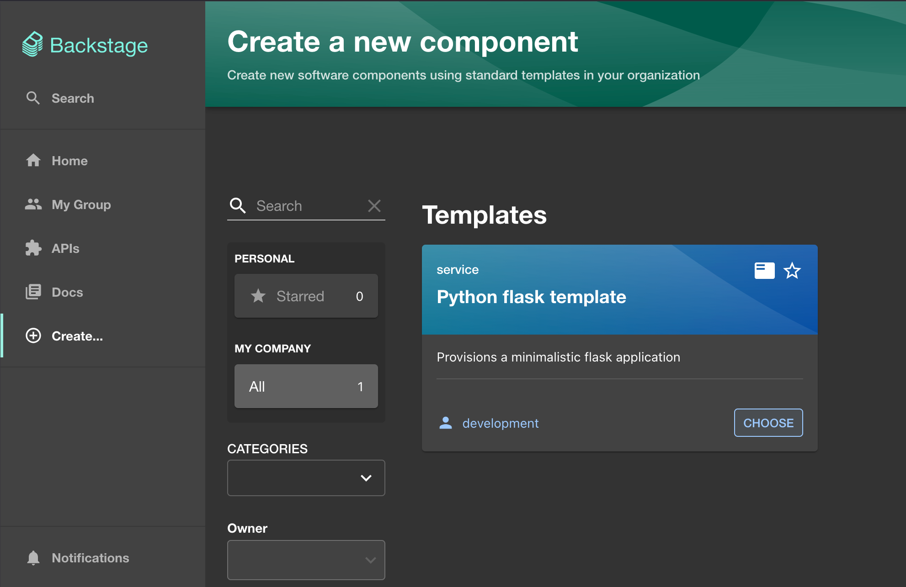
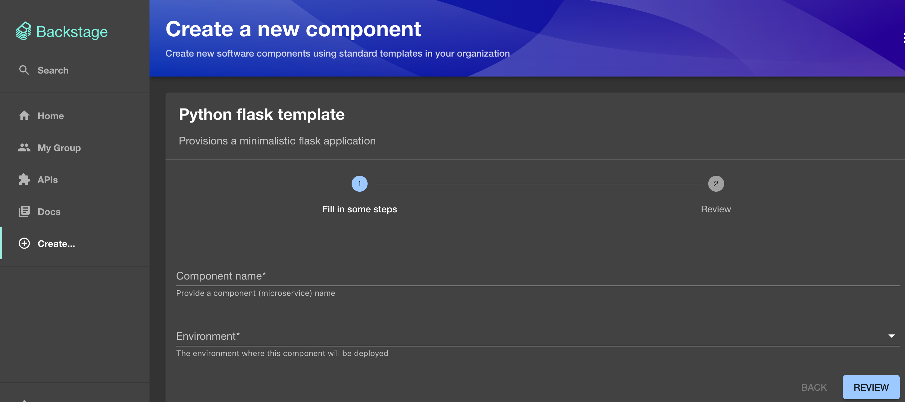
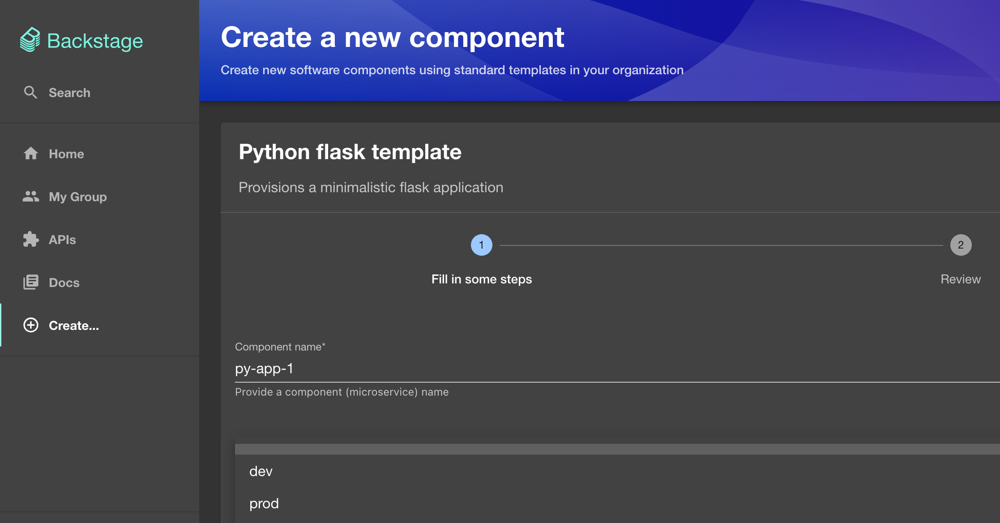
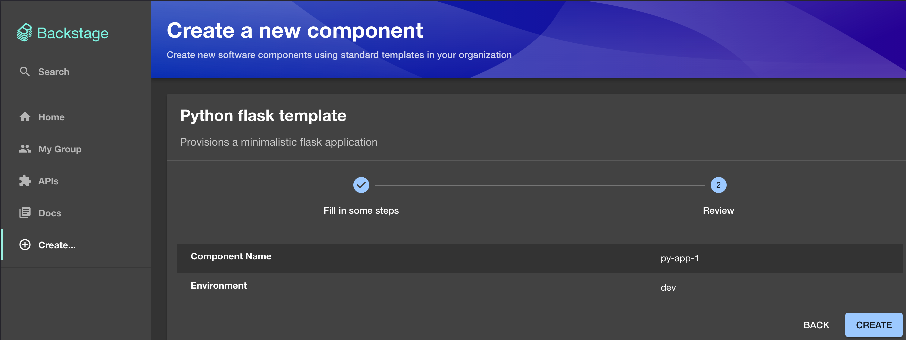

# Backstage IDP Software Template

This repo demonstrates the creation and working of a Backstage Software template for a simple Python app.
- It constitutes of GitHub Actions CI/CD pipeline that gets triggered once any change is performed to the "src" directory which holds the python app & when the change is done either:
	- If it is done directly on the main branch.
	- Or if a Pull request (PR) is executed and merged into the main branch.

##  How to use the app?
In order to use this app, following items are required to be installed on your machine:
-	python3
-	Docker engine
- Kubernetes Cluster including:
	- Helm
	- ArgoCD and ArgoCD CLI
	- Nginx Ingress Controller
	- OAuth Apps authentication in Github for the Backstage App. 
	    - Create the above & make a note of the Client ID and Client secret.
	- Create a self-hosted Github runner on your machine using the instructions from the following link:
https://github.com/actions/actions-runner-controller/blob/master/docs/quickstart.md
		
		- Whilst creating the runnerdeployment.yaml file using the steps in the above link, if the repository was specified as your local repo where this backstage-software-templates repo has been forked, then change the spec.template.spec.repository argument to be spec.tempate.spec.organization and put the name of your github organization as the value for that argument. 
		
- Create the following secrets in your GitHub Actions **Organizations repo**:
- DOCKERHUB_USERNAME
- DOCKERHUB_TOKEN
- ARGOCD_PASSWORD

Additionally, the following tokens will have to be created on Github:
- GITHUB_TOKEN with repo, workflow and admin:org permissions.
- AUTH_GITHUB_CLIENT_ID (the OAuth Apps Client ID)
- AUTH_GITHUB_CLIENT_SECRET (OAuth Client secret)

All the above secrets with their values must be configured as environment variables in the backstage k8s deployment file (provided as part of this repo - k8s-app.yaml). 
- In this repo, just for demo purpose, the values of these environment variables are directly used however, ideally these values should be extracted from secrets (for example Kubernetes secrets or external secret providers such as AWS Secrets Manager etc.)

### Install PostgreSQL and Kubernetes objects

Now install PostgreSQL helm chart in your Kubernetes cluster as below:

```bash
- helm repo add bitnami https://charts.bitnami.com/bitnami
- helm install psql bitnami/postgresql --version 15.5.28 --create-namespace -n backstage -f values-postgres.yaml
```
The values-postgres.yaml file used in the command above is included in this repo in the k8s folder.


Once the Postgres helm chart is installed in the backstage namespace of your Kubernetes cluster, first update the values of the environment variables in your k8s deployment (in the k8s-app.yaml file)  and then apply the k8s-app.yaml file  into the backstage namespace of your Kubernetes cluster as below:

```bash
kubectl apply -f k8s-app.yaml -n backstage
```
The k8s-app.yaml file is included in this repo and consists of k8s deployment, service and ingress objects that are needed to deploy this application.
 
The k8s deployment used for this app consists of a Backstage image built by the following Dockerfile:

```bash
FROM node:22-bookworm-slim  

# Set Python interpreter for `node-gyp` to use
ENV PYTHON=/usr/bin/python3  

# Install isolate-vm dependencies, these are needed by the @backstage/plugin-scaffolder-backend.
RUN --mount=type=cache,target=/var/cache/apt,sharing=locked \
--mount=type=cache,target=/var/lib/apt,sharing=locked \
apt-get update && \
apt-get install -y --no-install-recommends python3 python3-pip python3-venv g++ build-essential && \

rm -rf /var/lib/apt/lists/*

# Install the mkdocs python library
ENV VIRTUAL_ENV=/opt/venv
RUN python3 -m venv $VIRTUAL_ENV
ENV PATH="$VIRTUAL_ENV/bin:$PATH"  

RUN pip3 install mkdocs-techdocs-core  

# From here on we use the least-privileged `node` user to run the backend.
USER node
WORKDIR /app

# Copy files needed by Yarn
COPY --chown=node:node .yarn ./.yarn
COPY --chown=node:node .yarnrc.yml ./
COPY --chown=node:node backstage.json ./  

# This switches many Node.js dependencies to production mode.
ENV NODE_ENV=production

# This disables node snapshot for Node 20 to work with the Scaffolder
ENV NODE_OPTIONS="--no-node-snapshot"  

# Copy repo skeleton first
COPY --chown=node:node yarn.lock package.json packages/backend/dist/skeleton.tar.gz ./

RUN tar xzf skeleton.tar.gz && rm skeleton.tar.gz  

RUN --mount=type=cache,target=/home/node/.cache/yarn,sharing=locked,uid=1000,gid=1000 \
yarn workspaces focus --all --production && rm -rf "$(yarn cache clean)"
COPY --chown=node:node ./entities .  

# Then copy the rest of the backend bundle, along with any other files we might want.
COPY --chown=node:node packages/backend/dist/bundle.tar.gz app-config*.yaml ./
RUN tar xzf bundle.tar.gz && rm bundle.tar.gz  

CMD ["node", "packages/backend", "--config", "app-config.yaml", "--config", "app-config.production.yaml"]
```

### Run Backstage app

In this case, to run the Backstage app,  https://backstage.test.com has been defined. However, as this is not an actual DNS name, its entry has to be configured in the /etc/hosts file of your computer as below:

**/etc/hosts** file:
- 127.0.0.1  localhost
- 127.0.0.1 backstage.test.com

Doing the above, will allow to run and control this Backstage deployment from your browser.

- Type backstage.test.com on your browser and you will now be presented with the Backstage application page
- Click on "Create" from the left Column and you will be presented an option to choose the Templates as shown below:
    



- Click on "Choose" on this Python Flask Template and you will be presented with the "Create a new component" page as shown below:




- Provide a Component name 
    - And select the required environment (From dev or prod options) as shown below:




- Click on Review



- Confirm your chosen options and click on "Create"

This will now create the Python Flask application on your Kubernetes Cluster.

## Test the Application

- For instance if you have selected "py-app-1" as your Component name and "dev" as your environment, then the application name will formulate to be "py-app-1-dev.test.com"
    - In order to access this application from your browser, as there is no DNS name configured for this app, you will have to first modify the "/etc/hosts" file of your computer to have an entry for this link mapped to the localhost value as shown below:
    
        **/etc/hosts** file:
        - 127.0.0.1  localhost
        - 127.0.0.1 backstage.test.com
        - 127.0.0.1 py-app-1-dev.test.com

- Then on your browser type py-app-1-dev.test.com/api/v1/info and you will get the Python Flask app display the following:
